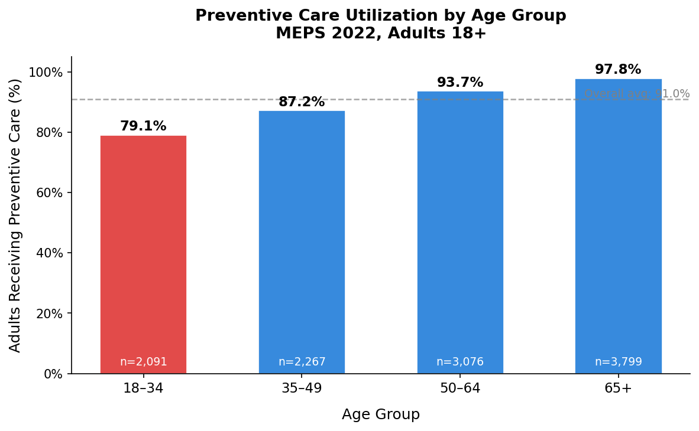
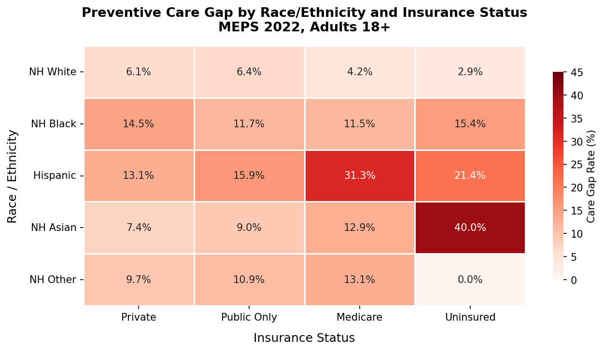
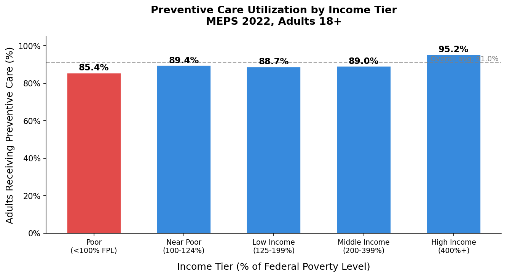
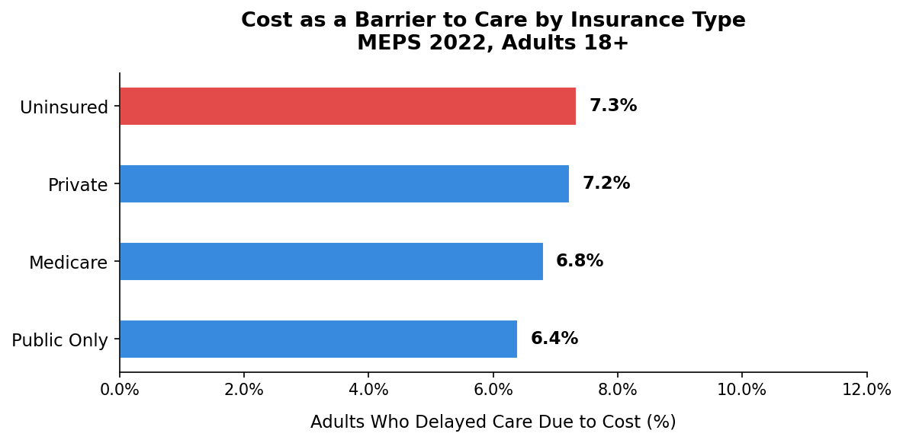
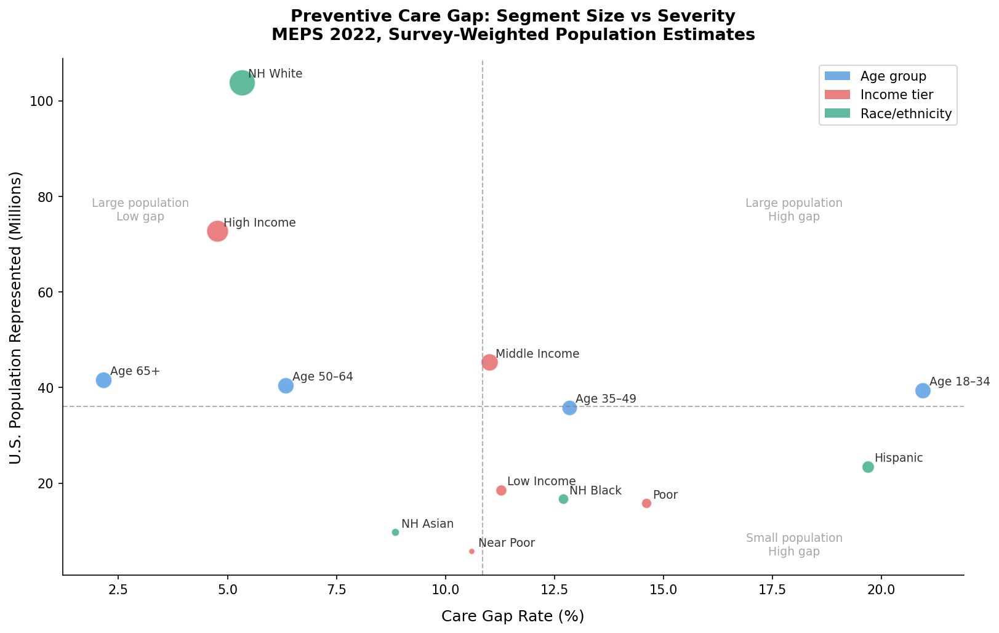
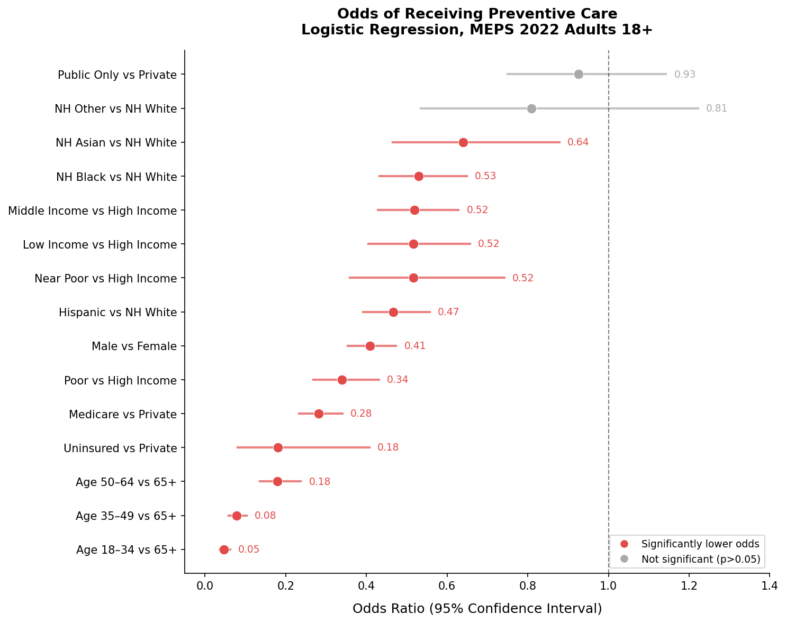
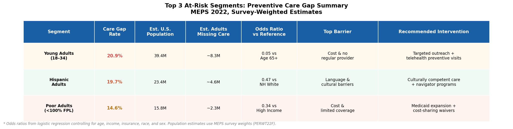

# Preventive Care Gaps in the U.S.: Who Falls Through the Cracks?

**A healthcare consulting-style analysis using MEPS 2022 survey data**

---

## Executive Summary

Health plans and Accountable Care Organizations (ACOs) invest heavily in preventive 
care because it works: it reduces downstream costs, improves member outcomes, and is 
directly measurable. But not every member is getting that care, and the gaps are not 
distributed evenly across the population.

This analysis uses the 2022 Medical Expenditure Panel Survey (MEPS), a nationally 
representative survey of 22,431 Americans, to identify which adults are least likely 
to receive recommended preventive care, what factors independently predict that gap, 
and which segments represent the highest-priority targets for outreach and intervention.

Three segments account for the largest preventive care gaps:

- **Young adults aged 18 to 34** — 20.9% care gap, representing approximately 
  8.3 million Americans not receiving recommended care
- **Hispanic adults** — 19.7% care gap, representing approximately 4.6 million Americans
- **Poor adults below 100% of the federal poverty level** — 14.6% care gap, 
  representing approximately 2.3 million Americans

After controlling for income, insurance, race, and sex in a logistic regression model, 
age is the single strongest predictor of non-utilization. Young adults aged 18 to 34 
have 95% lower odds of receiving preventive care than adults 65 and older, a disparity 
that holds even after accounting for income and insurance status.

---

## Context & Business Question

A regional health plan or ACO managing a diverse member population faces a practical 
problem: preventive care visits are not happening for a significant share of members, 
and identifying who those members are, and why they are not engaging, requires more 
than intuition. The business question this analysis addresses is:

> *Which members are least likely to receive recommended preventive care, and what 
> demographic, socioeconomic, and insurance-related factors predict that gap?*

Answering this question allows a health plan to:
- Prioritize outreach to the highest-risk segments first
- Design interventions matched to the specific barriers each segment faces
- Track gap closure over time as a quality improvement metric
- Demonstrate HEDIS measure improvement to regulators and purchasers

---

## Data & Methods

**Data source:** MEPS Full Year Consolidated File, 2022 (HC-243), published by the 
Agency for Healthcare Research and Quality (AHRQ). This is a nationally representative 
survey of the U.S. civilian noninstitutionalized population conducted annually. Each 
row represents one person, and each respondent carries a survey weight that allows 
results to be scaled to the full U.S. population.

**Analysis sample:** 17,909 adults aged 18 and older. Of these, 11,274 were asked 
about at least one preventive screening and are included in the utilization analysis. 
The remaining 6,635 adults were not asked about any screening because none of the 
age- and sex-specific screenings applied to them.

**Outcome variable:** A single yes/no variable called received_any_preventive, built 
by combining seven individual screening questions: Pap smear, mammogram, colorectal 
cancer screening, blood stool test, cholesterol check, blood pressure check, and flu 
shot. For each person, only the screenings that applied to their age and sex were 
considered. If a person received at least one applicable screening, they were coded 
as yes. If they received none, they were coded as no. This person-specific approach 
avoids penalizing men for not having a Pap smear or young adults for not having a 
colonoscopy.

**Predictors:** Age group (18 to 34, 35 to 49, 50 to 64, 65 and older), income tier 
as a percentage of the federal poverty level, insurance category, race and ethnicity, 
and sex.

**Methods:**
- Descriptive analysis of care rates by demographic and socioeconomic group
- Logistic regression using the statsmodels library in Python to identify which 
  factors independently predict non-utilization, with results reported as odds ratios 
  with 95% confidence intervals
- Population sizing using each respondent's survey weight to estimate how many 
  Americans each finding represents, not just how many people are in the sample

**A note on the overall rate:** The overall preventive care rate in this sample is 
91%, which is high. This is because blood pressure and cholesterol checks, which were 
asked of the largest share of adults, are routinely performed during any primary care 
visit. The more meaningful story lies in the variation across groups, and in the 
cancer screening and flu shot rates that are not captured in the overall composite.

---

## Finding 1 — Young Adults Are the Most Underserved Group

Adults aged 18 to 34 have a preventive care rate of 79.1%, the lowest of any age 
group and well below the overall average of 91%. Their care gap of 20.9% is nearly 
10 times larger than the gap for adults 65 and older (2.2%).

This finding is counterintuitive. Conventional thinking assumes younger adults need 
less healthcare. But the data suggests that younger adults are systematically 
disengaged from the preventive care system, not because they are healthy, but because 
the system is not reaching them effectively.

The logistic regression confirms this: after controlling for income, insurance, race, 
and sex, adults aged 18 to 34 have odds of receiving preventive care that are 95% 
lower than adults 65 and older (OR = 0.05, 95% CI: 0.036 to 0.062). This is the 
strongest effect in the entire model, larger than being uninsured, larger than being 
poor, and larger than any racial disparity measured in this analysis.

Why this gap likely exists:
- Young adults are most likely to be on high-deductible plans where cost-sharing 
  discourages visits even when preventive care is technically covered
- They are least likely to have an established primary care relationship
- Preventive care guidelines are less visible to younger adults who have not yet 
  developed regular healthcare habits

---

## Finding 2 — Race and Income Disparities Persist After Controlling for Insurance

The heat map reveals two important patterns.

**NH Black adults face persistent gaps regardless of insurance type.** NH Black adults 
have care gaps of 11.5 to 15.4% across all four insurance categories. This means 
that providing insurance coverage to a Black adult does not close the gap on its own. 
The logistic regression confirms this: NH Black adults have 47% lower odds of 
receiving preventive care than NH White adults after controlling for income, insurance, 
and age (OR = 0.53, 95% CI: 0.432 to 0.649). Something beyond coverage is driving 
this disparity, likely including historical distrust of the healthcare system, 
differential quality of care, and geographic access barriers.

**Hispanic adults on Medicare have the single largest cell-level gap at 31.3%.** This 
likely reflects that Hispanic adults who reach Medicare age may have had decades of 
limited preventive care engagement, creating deep-rooted barriers that standard 
outreach cannot easily overcome.

Income is independently associated with preventive care utilization at every tier. 
Poor adults have 66% lower odds of receiving care than high-income adults after 
adjustment (OR = 0.34). The income gradient is not perfectly linear: near-poor, 
low-income, and middle-income adults all cluster around an odds ratio of approximately 
0.52, with a sharp improvement only at the highest income tier. This suggests that 
below a certain income threshold, the specific dollar amount matters less than 
crossing into financial stability.

---

## Finding 3 — Cost Barriers Are Not Just an Uninsured Problem

One of the most striking findings in this analysis is how similar the cost barrier 
rate is across insurance types. Approximately 7% of adults delayed care due to cost, 
and this rate barely varies between uninsured (7.3%), privately insured (7.2%), 
Medicare (6.8%), and publicly insured (6.4%) adults.

This means that expanding insurance coverage alone will not eliminate cost-related 
care delays. Privately insured adults are delaying care at nearly the same rate as 
uninsured adults, most likely because high deductibles, copays, and out-of-pocket 
maximums make even covered preventive visits feel unaffordable.

The implication for health plans is direct: reducing cost barriers requires more than 
coverage. It requires eliminating cost-sharing specifically for preventive services 
and communicating clearly to members that preventive visits are covered at no cost 
under ACA-compliant plans.

---

## Segment Sizing & Prioritization

The bubble chart plots each segment by its care gap rate against its estimated U.S. 
population size, using survey weights to scale from the MEPS sample to the full 
U.S. population. Segments in the upper right represent the highest-priority targets: 
large populations with high gap rates.

Key observations:
- Adults aged 18 to 34 sit in the high-gap zone with 39.4 million people, the 
  largest absolute burden of any segment in this analysis
- Hispanic adults combine a 19.7% gap with 23.4 million people, a significant 
  absolute burden and the strongest race and ethnicity effect in the model
- Middle-income adults are a notable finding: 45 million people with an 11% gap, 
  the largest absolute population with a meaningful gap, a group often overlooked 
  in policy discussions that focus exclusively on the poor and uninsured

The forest plot shows the independent effect of each predictor after controlling for 
all others. Every predictor except public-only insurance and NH Other race is 
statistically significant. The age gradient is particularly striking: the odds ratio 
steps down sharply from 65 and older to 18 to 34, suggesting a systematic 
disengagement from preventive care that worsens with decreasing age.

---

## Recommendations

Based on this analysis, the following three segments and intervention approaches 
represent the highest-priority opportunities for a health plan or ACO looking to 
close preventive care gaps:

**Segment 1 — Young Adults (18 to 34)**
With a 20.9% gap affecting an estimated 39.4 million Americans, young adults are the 
single largest opportunity. The data points to two primary barriers: cost perception 
and lack of a regular provider relationship. Recommended interventions include:
- Telehealth-based preventive visits that eliminate transportation and scheduling 
  barriers (particularly effective for a generation comfortable with digital healthcare)
- Targeted outreach through text, app notifications, and social media rather than 
  mail or phone calls
- Clear and repeated communication that ACA-compliant plans cover preventive visits 
  at zero cost share, a fact many young adults are unaware of
- Partnerships with employers and universities to reach young adults through trusted 
  institutional channels

**Segment 2 — Hispanic Adults**
The persistent gap even among insured Hispanic adults, and the especially large gap 
among Hispanic Medicare enrollees (31.3%), points to cultural and linguistic barriers 
that coverage alone cannot address. Recommended interventions include:
- Community health worker programs using promotoras, trusted community members with 
  cultural and linguistic connection to the population
- Increase in spanish-language materials and communications across all member touchpoints
- Outreach through community organizations, churches, and cultural events where 
  trust is already established
- Care navigation support specifically for Medicare-enrolled Hispanic adults who may 
  have had limited preventive care engagement prior to age 65

**Segment 3 — Poor Adults (Below 100% FPL)**
With OR = 0.34, poor adults have the strongest income-related effect in the model. 
Cost and coverage gaps are the primary drivers. Recommended interventions include:
- Medicaid outreach and enrollment assistance for adults who are eligible but not 
  yet enrolled
- Full elimination of cost-sharing for preventive services for members near the 
  poverty line, going beyond ACA minimums
- Transportation assistance programs to address non-cost access barriers that 
  disproportionately affect this population
- Integration with social services to address food insecurity, housing instability, 
  and other social determinants that compete with healthcare as a priority

---

## Project Limitations

**Self-reported data.** MEPS relies on household interviews. Respondents may 
misremember or misreport whether they received specific services, which introduces 
measurement error into the outcome variable. Claims-based data would be more reliable 
for a production analysis.

**Composite outcome driven by routine checks.** The 91% overall rate reflects that 
blood pressure and cholesterol checks dominate the composite. The gap is likely 
larger for cancer-specific screenings such as mammogram, colonoscopy, and Pap smear, 
which were only asked of smaller eligible subgroups and are not broken out separately 
in this analysis.

**Small uninsured sample.** Only 112 adults in the eligible sample were uninsured, 
reflecting the difficulty of reaching this population in household surveys. The 
uninsured odds ratio (OR = 0.18) is statistically significant but carries a wide 
confidence interval (0.081 to 0.407). Estimates for this group should be interpreted 
with caution.

**Small cell sizes in the heat map.** Several race by insurance combinations, 
particularly NH Asian Uninsured and NH Other Uninsured, have very small sample sizes. 
The percentages in those cells are not reliable enough to drive segment-level 
decisions and are flagged accordingly.

**Unweighted regression.** The logistic regression was run without survey weights. 
Properly incorporating MEPS survey weights requires a survey-weighted regression 
framework. The odds ratios are directionally correct but standard errors and 
confidence intervals may be slightly underestimated.

**Cross-sectional data.** MEPS is a snapshot in time. This analysis identifies 
associations, not causes. We cannot conclude from this data that income or race 
causes lower preventive care utilization, only that they are independently associated 
with it after controlling for the other measured factors.

---

## What I Would Do With More Data

Public survey data like MEPS is a powerful starting point, but a real health plan 
engagement would unlock several additional analytical directions:

**Claims-based outcome validation.** Replacing self-reported screening data with 
claims-verified HEDIS measures (AWC, BCS, CCS, COL) would give more precise gap 
estimates tied directly to the metrics health plans are accountable for to regulators 
and purchasers.

**Longitudinal gap tracking.** Linking multiple years of claims data would make it 
possible to measure whether gaps close after specific interventions, turning this 
analysis from a diagnostic into an ongoing performance measurement tool.

**Social determinants integration.** Merging in ZIP-code level SDOH data covering 
food insecurity, housing instability, and transportation access would help explain 
the residual racial disparities that income and insurance alone cannot account for 
in this model.

**Cost impact modeling.** Translating each care gap into an estimated downstream cost 
avoidance figure would reframe this analysis as a financial ROI conversation, which 
is often the most effective way to secure executive sponsorship for quality improvement 
programs.

---

*Analysis conducted using MEPS HC-243 (2022). Full code and methodology available 
in the [GitHub repository](https://github.com/anikhajustin/preventive-care-gaps).*

*Tools used: Python, pandas, numpy, statsmodels, matplotlib, seaborn, Jupyter*